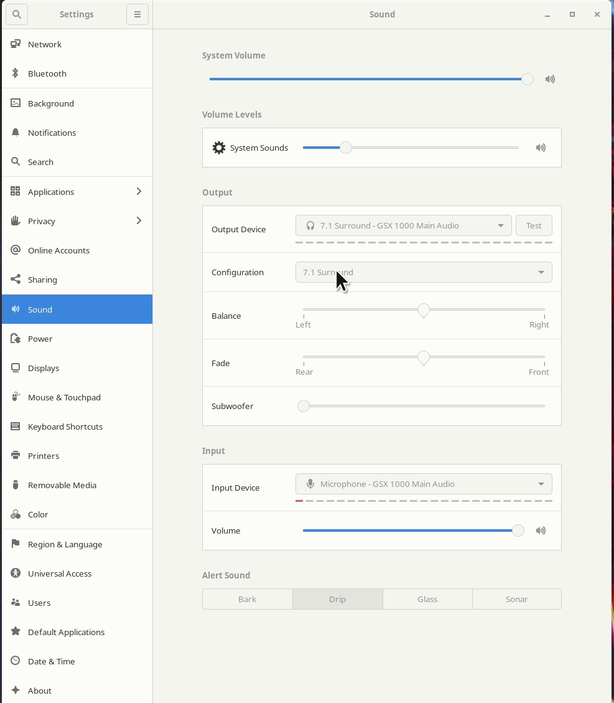
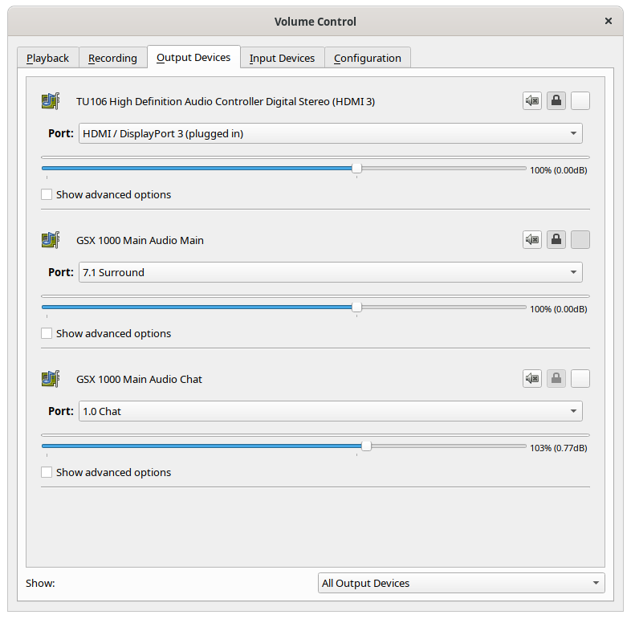
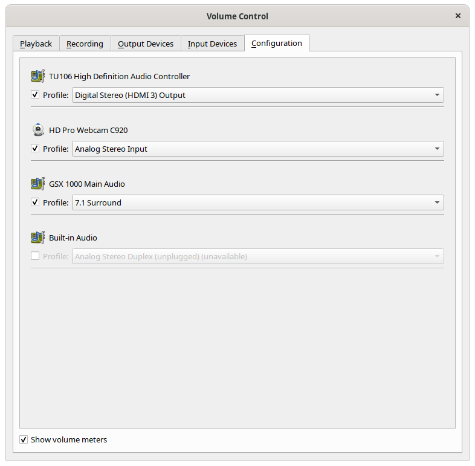

# sennheiser-gsx-1000 / 1200 Pro
Getting the Sennheiser GSX 1000 / 1200 Pro DAC to work under Linux

## Installation

Get the repo
```
git clone https://github.com/evilphish/sennheiser-gsx-1000
cd sennheiser-gsx-1000
```

Then just run

```
./scripts/install.sh
```

## Results





# Channel swap
if your center seems "lefty" or your subwoofer feels "righty" see [this issue](https://github.com/evilphish/sennheiser-gsx-1000/issues/9), you can swap channels

```
./scripts/swap-channels.sh [default|swapped]
``` 

## Uninstall

```
./scripts/install.sh uninstall
```

## Usage

You will get two output devices, **7.1 Surround** and **1.0 Chat**. The **main output** is the 7.1 Surround output you want to use for anything with high quality. The **1.0 Chat output** is a mono output that the GSX1000 / GSX1200 Pro will overlay over your 7.1 audio. You can adjust the offset volume of **7.1 Surround** vs **1.0 Chat** with the small volume rocker knob on the right side of the device. This is especially handy when it comes to mumble or teamspeak. If you pipe those applications into the mono output you can freely adjust the voice overlay with the small knob and still control overall volume with the large knob. It's super effective!

## What does not work?
Controlling the software volume with the big wheel results in the volume being lowered to zero as each turning direction counts as the multimedia key Volume-Down. The xorg.conf.d files mentioned above disable key inputs for the GSX devices to work around this issue. You could also delete or disable the multimedia volume keys in your keyboard settings (Who wants to use multimedia keys if you have the GSX 1000 for that). Nonetheless, it would be great if we could teach Linux that turning the knob clockwise means Volume-Up instead of down. If anyone has any insight into this, please drop me a line or open an issue! The internal volume adjustment of the GSX works though! So you can change the volume, just not in your system but in your deveice. 

## Arch Linux users
Just reboot after install
